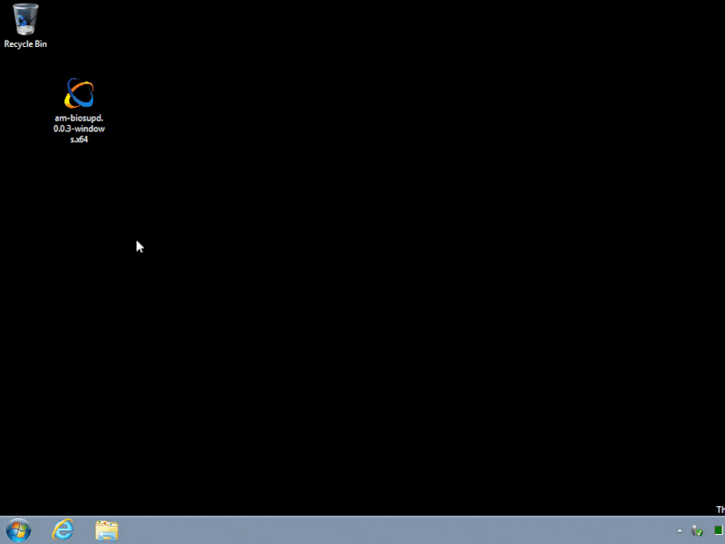
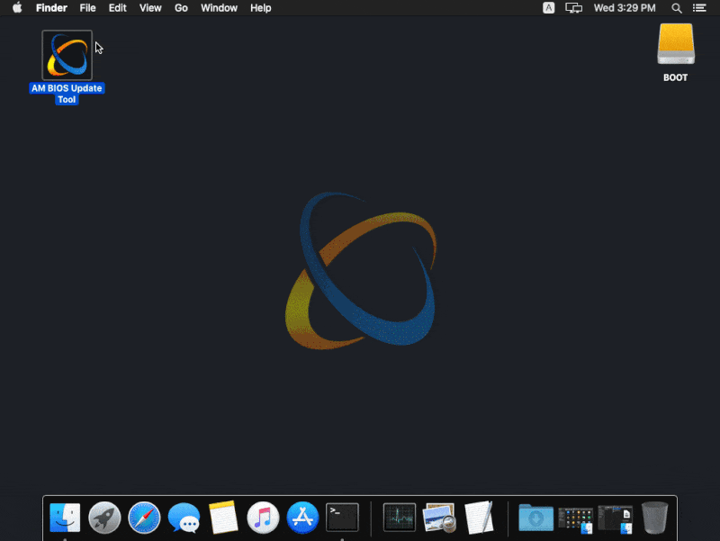
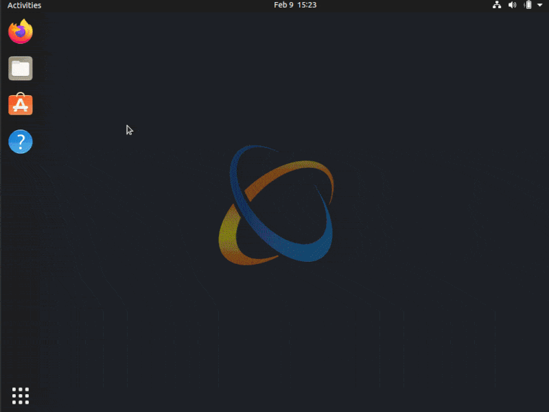
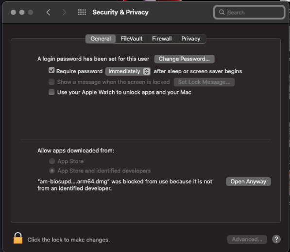

## Updating AM01 BIOS Firmware

AM01 BIOS is a part of AtomMiner Software architecture that runs inside the AM01 device and provides unified interface and various handlers for FPGA communication and configuration. As any other software, BIOS will receive updates every once in a while to offer overall software improvements and/or fixes to the well-known problems. We are trying our best to keep BIOS updates backaward-compatible so your devices can still be used with old software releases if you choose to do so.

Latest AM01 BIOS version is 0.0.4.14 published on Jan 30 2022 with following improvements:
 - Added hardware support for [Microsoft OS Descriptors for USB Devices](https://docs.microsoft.com/en-us/windows-hardware/drivers/usbcon/microsoft-defined-usb-descriptors);
 - Fixed multiple issues preventing Windows and MacOS from using device correctly;
 - Fixed multiple problems with timeouts and fragmented data transfers over USB1.1 bus;
 - Fixed data fragmentation issue that can cause "long" algorithms to provide false-positive results;
 - Improved communication protocol and FPGA configuration time down to 54ms with proper USB3.0 controller;

>  **NOTE** We strongly recommend to update BIOS on all your AM01 devices ahead of future software updates, even if you're using your devices on Linux OS.

### How to update 

BIOS updates are only available via BIOS Update Tool that can be downloaded from [atomminer.com/downloads](https://atomminer.com/downloads). BIOS Update Tool is available for most Operating Systems with Graphical User Interface: Windows, MacOS and Linux. Command-line version is not available for headless systems at the time of writing.

:::warning
- Please save AM01 Serial Number(s) before updating BIOS;
- Please make sure you have stable power source during BIOS update;
- Please do not disconnect your device until update is finished;
- Please do not start mining software while BIOS is being updated.
:::

:::note
- In case of power outage or sudden device disconnect during BIOS update you can effectively "brick" your device;
- BIOS Update Tool will do its best to put device in the recovery mode in case something went wrong;
- We will ask you for device serial number if it ended up in the recovery mode. We won't be able to help if you didn't save device Serial Number before updating it.
:::

Download BIOS Update Tool and start it to update your connected AM01's.
<div class="tabset">
  <input type="radio" name="tabset" id="tab1" aria-controls="win" checked>
  <label for="tab1">Windows</label>
  <input type="radio" name="tabset" id="tab2" aria-controls="mac">
  <label for="tab2">MacOS</label>
  <input type="radio" name="tabset" id="tab3" aria-controls="linux">
  <label for="tab3">Linux</label>
  
  <div class="tab-panels">
    <section id="win" class="tab-panel">
			<div>



</div>
  	</section>
    <section id="mac" class="tab-panel">
      <div>



</div>
    </section>
    <section id="linux" class="tab-panel">
      <div>



</div>
    </section>
  </div>

### Troubleshooting

Below are the common problems people can experience on various OSes with ways to fix them. Issues are grouped by OS. If you tried everything, but still unable to update device BIOS, please [contact us](mailto:support@atomminer.com) with detailed information and screenshots and we will do our best to help you to resolve your technical issues.

Please remember to restart (power cycle) your AM01 device after BIOS updates has completed successfully.

<div class="tabset">
  <input type="radio" name="tabset2" id="tab12" aria-controls="win2" checked>
  <label for="tab12">Windows</label>
  <input type="radio" name="tabset2" id="tab22" aria-controls="mac2">
  <label for="tab22">MacOS</label>
  <input type="radio" name="tabset2" id="tab32" aria-controls="linux2">
  <label for="tab32">Linux</label>
  
  <div class="tab-panels">
    <section id="win2" class="tab-panel">
			<div>

Known limitations: 
- Windows support is currently in extremely experimental mode due to endless Microsoft bugs and lack of documentation.
- AM01 with BIOS 0.0.4.13 or newer should be recognized by windows (according to Microsoft documentation), but in real life might not be recognized by random windows installs. Manual drive update is required in this case;
- AM01 with BIOS 0.0.4.12 or older will not be recognized by windows. Please install WinUSB driver manually;
- AM01 with BIOS 0.0.4.10 and 0.0.4.11 will not be possible to update from windows. Please use Linux or MacOS if you happened to have an old AM01.

**Most Common Issues**

<details>
  <summary>AM01 devices are not recognized by windows.</summary>

Install WinUsb driver for AM01 device. Driver can be installed using built-in windows driver update mechanism. If it doesn't work (likely), you can use [Zadig](https://zadig.akeo.ie/) open-source driver installer to install WinUSB driver to be used with AM01 devices.

</details>
<details>
  <summary>AM01 device(s) are still missing even after driver installation.</summary>
  Try starting BIOS Update Tool "as Administrator" or try another USB cable or USB port.
</details>
<details>
  <summary>BIOS Update Tool network error</summary>
  Turn off any anti-virus, firewall and VPN software on your computer and try again. Whitelist `AM BIOS Update Tool` in your antivirus if that worked.
</details>


</div>
  	</section>
    <section id="mac2" class="tab-panel">
      <div>

Known limitations: 
- Native M1 (arm64) version is currently not available. Please use x64 version with Apple's Rosetta 2.

**Most Common Issues**

<details>
  <summary><b>Error:</b> "am-biosupd.0.0.3-darwin.x64.dmg" can not be opened because it is from unverified developer.</summary>
  Please enable this application under 'Security & Privacy' settings:


</details>
<details>
  <summary>No connected AM01 devices in the app.</summary>
  Try another USB cable or USB port; Try to turn off any anti-virus, firewall and VPN software on your computer and try again.
</details>

</div>
    </section>
    <section id="linux2" class="tab-panel">
      <div>

Known limitations: 
- Raspberry Pi1 and Raspberry Zero are not supported;
- Headless and minimal server installs are not supported. Display manager is required to start the app;

**Most Common Issues**

<details>
  <summary>No connected AM01 devices in the app.</summary>
Set up udev rules using the following code snippet and try again:

```bash
wget -q -O - https://static.atomminer.com/software/linux-udev-rules.sh | sudo bash
```

</details>
<details>
  <summary>BIOS Update Tool network error</summary>
  Check your internet connection and try again.
</details>

</div>
    </section>
  </div>
  
</div>


### Still not solved?

If the issue persists after trying each solution for your operating system (OS), please reach out to [AtomMiner Support](mailto:support@atomminer.com).

Related: [How to update mining software](/kb/update-mining-software)

Related: [Reporting Issues and Requesting New Features](/kb/report-issues-and-feature-requests)

