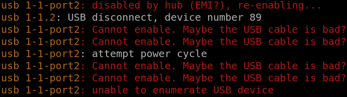

## Bad or Damaged USB Cables

USB cables can stop working properly/stable after some active usage and/or if they are being damaged by external force like bending them under extreme angels etc. Moreover, there's a lot of USB cables on the market that will work for charging or "slow" devices, but stops working every time data has to be transmitted.

Linux kernel is pretty good and helpful when it comes to identifying the problem(s). One can inspect kernel log via `sudo dmesg` at any time to check any and all potential hardware errors.

Let's look at the most typical cases of bad or damaged USB cables.

### Error -71 dmesg log

Here's one of the examples


As we can see in `dmesg` log, this error message refers to the USB port that caused the issue. As `errno` suggests, this is POSIX protocol error `EPROTO` inverted:
```bash
$ errno 71
EPROTO 71 Protocol error
```

Error reference: [source/drivers/usb/core/hub.c](https://elixir.bootlin.com/linux/v5.11.22/source/drivers/usb/core/hub.c#L4723)

Based on our experience, we can recommend the following steps:
* Check your cables: 90% of such issues are caused by bad cables. Switching for another tested working cable will solve the issue.
* Check your connectors: This is a common issue on old computers or worn-out sockets with loose connection. Try to wiggle USB cables a bit and see if anything changes. Don't overdo it as USB connectors are easy to break.

### Error "Cannot enable. Maybe the USB cable is bad?"

Here's one of the examples


Error is pretty much self descriptive. Please replace your USB cable with another tested working cable.

## Conclusion

It is normal process for the cables to stop working over time with normal wear-and-tear usage. If your system reports USB communication or protocol errors in the kernel log, it is probably perfect time to replace your USB cables with the quality new ones.