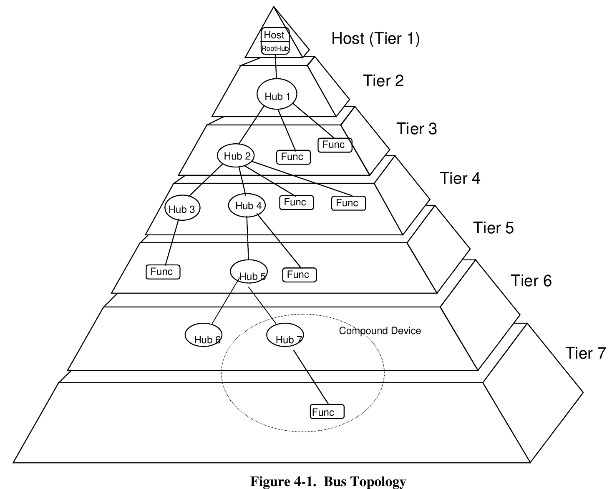

## USB Structure. USB Facts

The USB specification defines two different connectivity types in the USB tree topology: number of tiers and number of endpoints:

The USB specification is limited to a maximum of 7 tiers. Which comes to a maximum of 5 daisy-chained USB hubs. 

Architecturally, to achieve multiple USB ports on the hub, hardware developers cascading 2, 4 and/or 7-port hubs inside the device known as a USB hub. It is worth to note here that each USB hub is a USB device as well with at least 1 endpoint defined on the chain and takes up 1 address on the USB Bus. This means that an average 16-port USB hub will need up to 5 USB addresses for the hub itself. 

xHCI controller specification was designed by Intel with great contribution from more than 100 other companies, including USB-IF which has also funded a set of xHCI Compliance Tests to maximize the compatibility of the various xHCI implementations (supposedly).

While xHCI architecture was designed to support all USB speeds, including SuperSpeed and future speeds, under a single driver stack, it leaves the freedom for the vendor/manufacturer to define the amount of resources necessary to meet its marketing requirements. For instance, a vendor could choose to limit the number of USB devices that it supported for a tablet xHCI implementation to 16 devices.

In theory, the [xHCI specification](http://www.intel.com/content/dam/www/public/us/en/documents/technical-specifications/extensible-host-controler-interface-usb-xhci.pdf) allows large maximum values for the number of USB devices (up to 254 devices), ports (up to 254 root hub ports), interrupt vectors.

In the real life, we see completely different picture when vendors leaning towards cheap designs that are being sold as a full-working systems.

It is sad when standards aren't all that standard and marketing runs amok.

### USB Endpoints

Each USB device can define up to 31 endpoints, with endpoint 0 being a control endpoint, and xHCI that supported 255 devices would have to support 7,906 separate total endpoints. 

Now we enter a mystery zone where a generic USB device is assumed to define only 3 endpoints: control, in and out. Common implementations of the xHCI controllers only includes 96 endpoints. This means that the maximum number of common devices which use 3 endpoints able to be attached to an Intel series 8 xHCI host controller is actually 96 endpoints / 3 endpoints per device = 32 devices.

Based on [some information from Intel](https://community.intel.com/t5/Embedded-Intel-Core-Processors/Hardware-limitations-on-USB-endpoints-XHCI/td-p/264556?profile.language=en):
>There are potentially more endpoints with EHCI; for every one XHCI connected device you could instead have two EHCI devices. The XHCI limitation is based on system memory, it is not a limitation of the USB specification.

As it seems, the only way to add more USB devices into a single system is to give up USB3.0 functionality.

### USB Hubs and USB Limits

Interestingly enough that device like AtomMiner AM01 that only define 2 USB endpoints instead of 3, still hitting the same limitations of the xHCI controller. If you try to connect more than 27 AM01 devices to your Raspberry Pi 4, you can find similar messages in your kernel log via `sudo dmesg`:
```
[75568.271665] xhci_hcd 0000:01:00.0: Error while assigning device slot ID  
[75568.271681] xhci_hcd 0000:01:00.0: Max number of devices this xHCI host supports is 32.
```
With 96 endpoints available on the commonly available Intel XHCI-based host systems, many host machines use USB internally for built-in peripherals, including webcams, touchscreens etc. Therefore, the number of external devices that can be connected is different for every system.

Exact number of USB3.0 devices depends on your USB hub configuration, USB addresses required for the hub itself and other USB peripheral devices connected. 

Forcing USB2.0 by using USB2.0 data cables for the AM01 doesn't help to connect more USB devices on Raspberry Pi 4 with xHCI driver loaded. Attempts to offload more devices to the USB2.0 Host Controller on the RPi4 have failed as well.

## Solution

One of the solutions we have found so far to overcome USB3.0 limitations is to force your system or equipment to work in the legacy USB2.0 mode; Another solution is to add more USB host controllers to the system, where it is possible.
Unfortunately, in case of Raspberry Pi 4, the only way to connect more devices is to disable xHCI driver.

:::tip
The best option to have more than 32 AM01 working on your Raspberry Pi is to use older Raspberry Pi 3b+ that doesn't have USB3.0 support thus doesn't have xHCI driver loaded with all its limitations.
:::

### Hardware Solution

One of the simplest solutions is to use USB2.0 data cable to connect your hub and/or your AM01 equipment to force them to work in USB2.0 mode. This should force USB3.0 equipment (including hubs) to work in USB2.0 mode. However some USB Host Controllers, namely Intel eXtensible USB3.0 controller, might still not support more than total of 32 devices connected to USB Bus. During our tests, most of the Intel USB3.0 controllers we tested experienced hardware crash that required full system power off (even removing battery on the laptop systems).

If you're lucky to have multiple USB Host controllers in your system, you can redistribute your equipment between host controllers.

Additional USB controllers (addon board) is an option for desktop systems as well.

Another good option is to disable USB3.0 support completely in your BIOS if USB3.0 is not required for other USB peripherals. Unfortunately this option doesn't remove connected USB device limits on some Intel controllers.

### Software Solution

Software solution is to disable XHCI driver in your system and force USB Host Controller to EHCI mode.

If you look at the [xHCI kernel sources](elixir.bootlin.com/linux/v5.11.22/source/drivers/usb/host/xhci.c#L5582), it is clear that you can completely disable xHCI driver in your system and force-use eHCI instead. If you're lucky enough to have xhci driver used as kernel module (run `lsmod | grep xhci` to find out), then it is the matter of disabling `xhci_pci` and/or `xhci_hcd` modules in your system with the following commands:
```bash
sudo rmmod xhci_pci
sudo rmmod xhci_hcd
```
In fact, most of the modern kernels have xhci driver built-in these days, thus disabling it will take some extra steps. In order to disable xHCI driver, you will have to modify your kernel command line with following parameter `initcall_blacklist=xhci_hcd_init`

Command line parameters can be (typically) found
 - `/etc/default/grub` on desktop systems;
 - `/boot/cmdline.txt` or `/boot/firmware/cmdline.txt` on embedded systems like Raspberry Pi;
 - `/boot/extlinux/extlinux.conf` if your system is using `extlinux` bootloader.
*Please consult your OS manuals if you can't locate any of the mentioned bootloaders.*

There is another method for older Intel USB controllers described here: [How to force a USB 3.0 port to work in USB 2.0 mode in Linux?](https://www.systutorials.com/how-to-force-a-usb-3-0-port-to-work-in-usb-2-0-mode-in-linux/). However it didn't work with newer Intel controllers during our tests.

## Conclusion

While it is possible to disable USB3.0 functionality on some hardware, it leaves users without Super-Speed USB3.0 connection. It doesn't seem like there is any option to selectively control the amount of endpoints and maximum amount of devices connected to USB3.0 bus.

If you're planning to use more than 32 USB devices in your system, we would highly recommend to use hardware that does not support USB3.0 functionality until further note.
