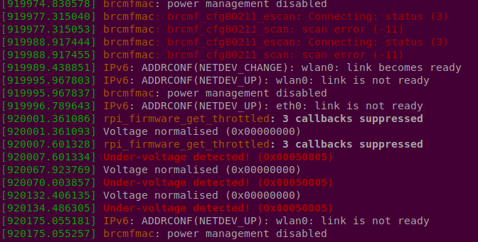
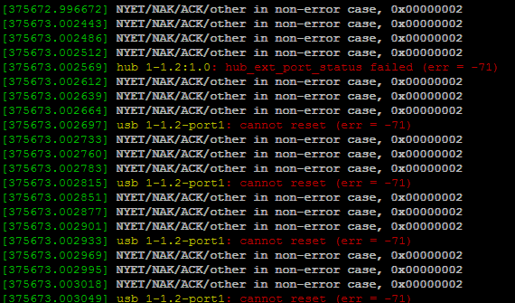

## Power Issue Symptoms

Stability of your Raspberry Pi or similar single-board computer can be affected in an unpredictable way by the problems with your power supply and/or power delivery.
> If the **Red Power LED** is not illuminated this means the supply voltage is inadequate. (The newer Pi have a well engineered power circuit, and may continue to function even if the input voltage is below spec; the same may not be true for peripherals). The GUI had an rainbow indicator (replaced by a **lightning bolt**) which comes up in the top right if the voltage is inadequate. This has a 3 second timer, and may display even if the LED appears to be lit.

> **NOTE** the **Red Power LED** on the Pi3B+, Pi3A+, Pi4B only functions if the SD Card/USB key has up to date firmware because it is controlled by software - it is meaningless otherwise.

The most common indicators that your RPi might be struggling from under- or over- voltage include, but not limited to the following:

* System (OS) freezes randomly, or on minor CPU loads;
* CPU frequency throttles down while temperature  stays normal
* Connected mouse or keyboard is laggy ;
* WiFi and/or Bluetooth randomly disconnecting;
* Lightning bolt appears in the top-right of your screen;
* USB Devices, including AM01 disconnecting/reconnecting randomly.

## Raspberry Pi Power Requirement

 The Raspberry Foundation has [recommendations](https://www.raspberrypi.org/documentation/computers/raspberry-pi.html#typical-power-requirements) for various models which range from 700mA to 3.0A. Please consult with User Manual if you're using a single-board computer from another manufacturer. The actual current depends on the CPU load and the peripheral used with your RPi. As per Raspberry's Power Requirements, each connected USB device will increase the current drawn from its power supply.

### USB Power Supply

To sustain uninterruptible and stable work of your single-board computer, power source **MUST** provide 5±0.25V at its current rating. That information is typically printed on the power supply product label. The current rating printed on the power supply is is the **MAXIMUM** current that can be safely drawn without causing the output to drop below its rated voltage. Unfortunately, very many supplies do not actually meet their published ratings, including many sold by Pi retailers. We have tested a number of PSU with a dummy load and have yet to find one which actually delivers the rated voltage at the rated current.

> **NOTE** Many users worry that that they may "supply too much power" by using a higher rated supply. The Pi will only draw as much current as it requires and can not use more then 2.5A (Pi3) or 2A (Pi2/B+) as this is limited by a fuse. Using a power supply with higher current rating will not damage your computer, while working far from its maximum capabilities. It is usually good idea to have a power supply with its maximum current rating 30-50% more than required by the hardware. Please make sure that your power supply voltage matches source voltage of your hardware (5VDC for the Raspberry Pi devices).
> 
You should be wary of cheap USB power supplies. Many of these have very poor voltage regulation. Many modern smartphones are designed to draw more current than the normal USB 500mA max. Phone manufacturers often supply higher current chargers, either by non-standard means or by adopting the new USB Charger spec, which permits higher currents, but permits voltage to drop to 3.6V. These are OK for charging smartphones, but **NOT OK** for voltage sensitive devices like the Pi or similar. They may appear to work OK for a lightly loaded Pi, but may not if many peripherals are connected.

### Powered USB Hub as a Power Source

Our tests showed that it might be safe to use High-Power USB Hubs as a power source for the Raspberry Pi or similar single-board computers. However many of USB Hubs claiming to provide 2.4-3A current per port do not meet RPi's minimal power requirements. On top of that many of the USB Hubs lack overcurrent protection and other safety feature that can damage your RPi and connected USB devices. We will publish our list of recommended USB Hubs in the Resources section of this website.

### USB Power Cable

No matter how good your Power Supply if you use **poor quality cables** to connect to the Pi you will have problems like random WiFi disconnects, AM01 being constantly disconnected, system freezes and so on. Majority of μUSB cables are designed to carry data, and have very thin wiring. This makes the cables thin, light and inexpensive but they are unsuitable for power. To remain within the specification, there should be less than 0.25V voltage drop across the cable at 3A current.

Cables designed for charging smartphones are probably the best bet, and always use the shortest possible cable for power delivery.  While thin USB cables (23AWG or thinner) can work with your particular power supply and and single-board computer, we recommend to use 20AWG (0.50 mm<sup>2</sup>) or 22AWG (0.34 mm<sup>2</sup>) USB cables for power delivery to your RPi to meet Raspberry power requirement.

## Troubleshooting Power Issues

### Inspect diagnostic message output

Linux system has really useful diagnostic message tool called `dmesg` which contains a lot of information about the running system, internal errors and status changes. You can inspect diagnostic messages on your system with the following command:
```bash
sudo dmesg
```
You could see various errors in the diagnostics log, following are the most common:


### Health Check Script

We've created a helper script that can help to spot under-voltage and other typical problems that can be requested from the RPi CPU. You can run the script using the following code snippet in your terminal or SSH session:
```bash
wget -q -O - https://static.atomminer.com/os/rpi/rpi-voltage-check.sh | bash
```

Sample output on a typical system with inadequate power supply or power cable :

```bash
pi@raspberrypi:~ $ wget -q -O - https://static.atomminer.com/os/rpi/rpi-voltage-check.sh | bash
39.7'C 1400 / 600 MHz 1.2V - Throttling has occurred, Under-voltage has occurred, Currently throttled, Under-voltage detected,
```

In some rare cases it has hard to spot under-voltage on the idle system. To address this problem, you can run the watch version of the script above and start CPU intensive task. In our tests, the best approach to detect power issues was to use 2 USB memory sticks and start copying large amounts of data from one thumb drive to another.  Watch script can be started as follows:
```bash
wget -q -O - https://static.atomminer.com/os/rpi/rpi-voltage-check-watch.sh | bash
```
Example of error detection:
```
39.7'C 1400 / 600 MHz 1.2V -
40.2'C 1400 / 600 MHz 1.2V -
40.7'C 1400 / 600 MHz 1.2V -
42.6'C 1400 / 600 MHz 1.2V -
48.3'C 1400 / 600 MHz 1.2V -
52.1'C 1400 / 1400 MHz 1.2V - Throttling has occurred, Under-voltage has occurred
61.1'C 1400 / 1400 MHz 1.2V - Throttling has occurred, Under-voltage has occurred, Currently throttled, Under-voltage detected
61.9'C 1400 / 1400 MHz 1.2V - Throttling has occurred, Under-voltage has occurred, Currently throttled, Under-voltage detected
.......
42.5'C 1400 / 600 MHz 1.2V -
40.7'C 1400 / 600 MHz 1.2V -
38.3'C 1400 / 600 MHz 1.2V -
```
Which clearly indicates that power problems only exists under the load.

## How to fix 

1. Verify that you're using stable 5VDC power supply rated at 3A or more. 
2. Make sure that your microUSB power cable has at least 22AWG wires. 
3. Replace power cable with the shortest possible from your power supply to your RPi.

Test your system again to make sure power problem is gone.