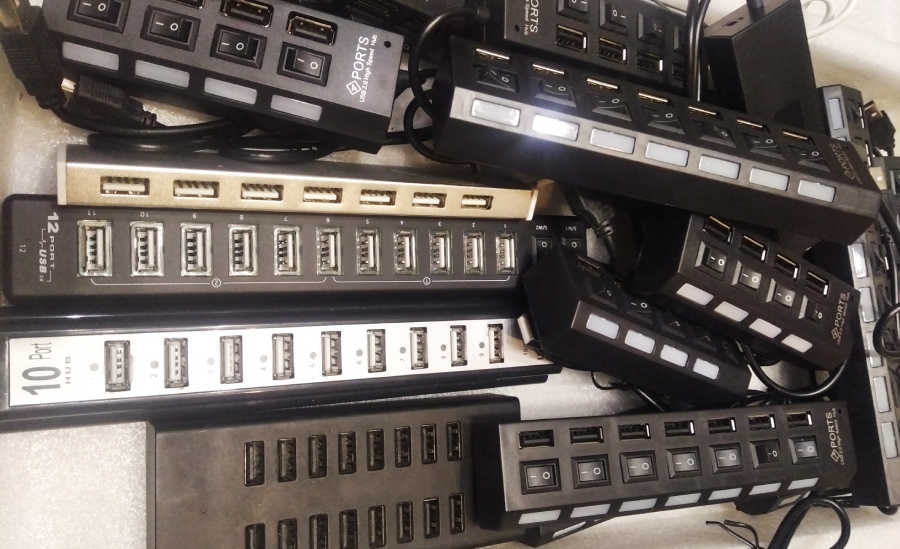
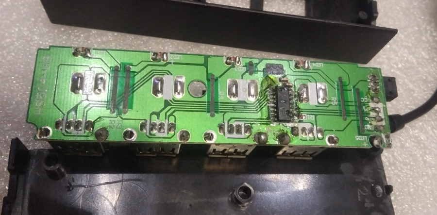

## Unsafe and Dangerous USB Hubs

USB 2.0 with its 480 Mbps theoretical bandwidth has become ubiquitous in PCs of all sizes and shapes. However, unwary consumers may not be getting the high-bandwidth connection they believe they are when buying USB 2.0 Hubs.
USB-IF is pretty good at confusing customers and developers by providing muddy definitions and then "clarifying" such definitions with even more confusing information.

We have tested numerous inexpensive USB2.0 hubs from different manufacturers available on the market to help our users to understand what could be causing problems in their system(s). It turns out that majority of inexpensive hubs are simply USB1.1 hubs with modified device descriptors to trick user's OS (specifically, Windows) to display the hub as a true USB2.0 hub...aside from other major issues we have discovered, which are discussed at the bottom of this article. 


We were able to run 1x AM01 device off of USB1.1 hub during our tests (not without issues), however connecting more than one USB device that needs fast/frequent communication with the host leads to all sorts of hard-to catch problems starting from random timeouts and disconnects to hubs becoming unresponsive.

Let's start from some USB background first.

### A Little Bit of History

USB speed of 12MBit/s was first introduced with USB1.0 specification and successfully migrated into the updated version USB1.1 we all used for quite some time (Source: [Sections 4.2.1, 11.2.5 of USB1.0 Specification](https://fl.hw.cz/docs/usb/usb10doc.pdf))

As per [USB2.0 Specification](https://www.usb.org/document-library/usb-20-specification) Low-speed (1.5MBit/s) and Full-speed (12MBit/s) stays exactly the same as they were defined in USB1.1 for backward compatibility and support of older devices.

> USB 2.0 was released in April 2000, adding a higher maximum signaling rate of 480 Mbit/s (maximum theoretical data throughput 53 MByte/s) named _High Speed_ or _High Bandwidth_, in addition to the USB 1.x _Full Speed_ signaling rate of 12 Mbit/s (maximum theoretical data throughput 1.2 MByte/s). (Source: [Wikipedia](https://en.wikipedia.org/wiki/USB#USB_2.0))

### Recognizing USB1.1 Hubs

The easiest way to check the speed your hub is working on is to issue `lsusb -t` command in your terminal. It will print out your USB device tree along with device speed for each connected USB device, including hubs:
```bash {10}
$ lsusb -t
/:  Bus 02.Port 1: Dev 1, Class=root_hub, Driver=xhci_hcd/2p, 10000M
    |__ Port 2: Dev 6, If 0, Class=Hub, Driver=hub/4p, 5000M
        |__ Port 3: Dev 7, If 0, Class=Hub, Driver=hub/4p, 5000M
        |__ Port 4: Dev 8, If 0, Class=Hub, Driver=hub/4p, 5000M
/:  Bus 01.Port 1: Dev 1, Class=root_hub, Driver=xhci_hcd/4p, 480M
    |__ Port 2: Dev 91, If 0, Class=Hub, Driver=hub/4p, 480M
        |__ Port 4: Dev 94, If 0, Class=Hub, Driver=hub/4p, 480M
            |__ Port 4: Dev 95, If 0, Class=Human Interface Device, Driver=usbhid, 1.5M
            |__ Port 2: Dev 96, If 0, Class=Hub, Driver=hub/4p, 12M
```

Highlighted line shows that there is USB1.1 hub connected. In case more troubleshooting required, you can get more info about this hub with `lsusb`. First, we need to find out hub's VID:PID identifier. As we can see in device tree, USB1.1 hub is connected to Bus 01 as device number 96.
```bash {8}
$ lsusb
Bus 002 Device 008: ID 0bda:0411 Realtek Semiconductor Corp. 
Bus 002 Device 007: ID 0bda:0411 Realtek Semiconductor Corp. 
Bus 002 Device 006: ID 0bda:0411 Realtek Semiconductor Corp. 4-Port USB 3.0 Hub
Bus 002 Device 001: ID 1d6b:0003 Linux Foundation 3.0 root hub
Bus 001 Device 095: ID 046d:c077 Logitech, Inc. M105 Optical Mouse
Bus 001 Device 094: ID 0bda:5411 Realtek Semiconductor Corp. 
Bus 001 Device 096: ID 0a05:7211 Unknown Manufacturer hub
Bus 001 Device 091: ID 0bda:5411 Realtek Semiconductor Corp. 4-Port USB 2.0 Hub
Bus 001 Device 001: ID 1d6b:0002 Linux Foundation 2.0 root hub
```
Here we can pass `ID` of the troublesome hub to `lsusb` in order to get its detailed information:
``` {10,15-17,66}
$ sudo lsusb -vv -d 0a05:7211

Bus 001 Device 096: ID 0a05:7211 Unknown Manufacturer hub
Device Descriptor:
  bLength                18
  bDescriptorType         1
  bcdUSB               2.00
  bDeviceClass            9 Hub
  bDeviceSubClass         0 
  bDeviceProtocol         0 Full speed (or root) hub
  bMaxPacketSize0         8
  idVendor           0x0a05 Unknown Manufacturer
  idProduct          0x7211 hub
  bcdDevice            1.00
  iManufacturer           0 
  iProduct                1 USB2.0 HUB
  iSerial                 0 
  bNumConfigurations      1
  Configuration Descriptor:
    bLength                 9
    bDescriptorType         2
    wTotalLength       0x0019
    bNumInterfaces          1
    bConfigurationValue     1
    iConfiguration          0 
    bmAttributes         0xe0
      Self Powered
      Remote Wakeup
    MaxPower              100mA
    Interface Descriptor:
      bLength                 9
      bDescriptorType         4
      bInterfaceNumber        0
      bAlternateSetting       0
      bNumEndpoints           1
      bInterfaceClass         9 Hub
      bInterfaceSubClass      0 
      bInterfaceProtocol      0 Full speed (or root) hub
      iInterface              0 
      Endpoint Descriptor:
        bLength                 7
        bDescriptorType         5
        bEndpointAddress     0x81  EP 1 IN
        bmAttributes            3
          Transfer Type            Interrupt
          Synch Type               None
          Usage Type               Data
        wMaxPacketSize     0x0001  1x 1 bytes
        bInterval             255
Hub Descriptor:
  bLength               9
  bDescriptorType      41
  nNbrPorts             4
  wHubCharacteristic 0x0009
    Per-port power switching
    Per-port overcurrent protection
  bPwrOn2PwrGood       50 * 2 milli seconds
  bHubContrCurrent    100 milli Ampere
  DeviceRemovable    0x00
  PortPwrCtrlMask    0xff
 Hub Port Status:
   Port 1: 0000.0100 power
   Port 2: 0000.0100 power
   Port 3: 0000.0303 power
   Port 4: 0000.0100 power
can't get device qualifier: Resource temporarily unavailable
can't get debug descriptor: Resource temporarily unavailable
Device Status:     0x0001
  Self Powered
```
[USB2.0 Specification](https://www.usb.org/document-library/usb-20-specification) clearly states the values of the device descriptor that should be used in full/low-speed classes, and that's exactly what we see in the hub descriptors.
> A hub operating at full-/low-speed has a device descriptor with a bDeviceProtocol field set to zero(0) and an interface descriptor with a bInterfaceProtocol field set to zero(0). The rest of the descriptors are the same for all speeds.

> Two descriptors allow a high-speed capable device to report configuration information about the other operating speed. The two descriptors are: the (other_speed) device_qualifier descriptor and the other_speed_configuration descriptor. These two descriptors are retrieved by the host by using the GetDescriptor request with the corresponding descriptor type values.

This tells us that the hub in the question can only work in USB1.1 mode with top speed of 12 MBit/s. The hub is missing `iManufacturer` and `iSerial` string descriptors while reporting `USB2.0 Hub` as its `iDevice` string descriptor, which is enough for many OS systems to display this hub as `USB2.0 Hub` because system left with no other options to identify it.

### Other USB Hub Issues

Once we break the hub apart, we can notice a few major hardware problems:


Unfortunatel, the following problems are present in the most USB hubs we have tested, including those that actually provide honest USB2.0 interface on the downstream ports:
* there's absolutely no capacitor(s) on upstream or downstream ports, which could and will result in hard-to-catch problems when operating this hub. Reference: [Section 7.2.4.1 Inrush Current Limiting of USB2.0 Specification](https://www.usb.org/document-library/usb-20-specification)
* “Per-port power switching” & “Per-port overcurrent protection” is a complete lie. Reference: [Sections 11.11 Hub Port Power Control; and 7.2.1.2.1 Over-current Protection; of USB2.0 Specification](https://www.usb.org/document-library/usb-20-specification);
* Last, but not least, the external power is not isolated from the VBUS inside the hub. What this means is that there's a pretty good chance to destroy your USB host controller along with all your USB peripheral devices in case something happens to the external power supply.

## Conclusion

Most of the hubs we tested are simply dangerous to use with your equipment (especially with AM01 miners). Most of them, however, should work ok with all sorts of low-speed peripheral like keyboard, mouse, MIDI instruments etc. in the passive mode (without external power supply), but must not be used with the high-speed devices and/or USB-powered devices.

:::note
AM01 is not designed to work over USB1.1 connection. Reliable and stable USB2.0 connection is recommended to operate AM01 device(s).
:::

## Related Articles

* [What are Multiple TT (MTT) USB Hubs?](./what-are-multiple-tt-mtt-usb-hubs)
* Choosing the Right USB Hub for Multiple AM01