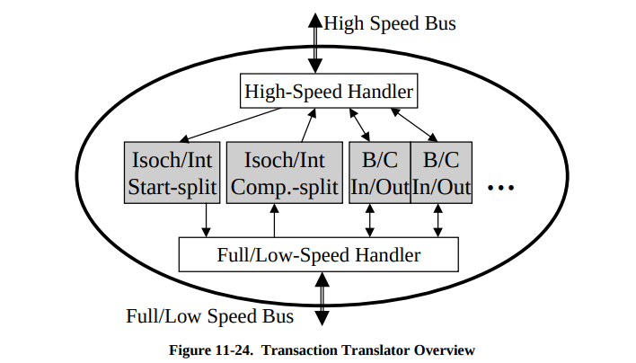
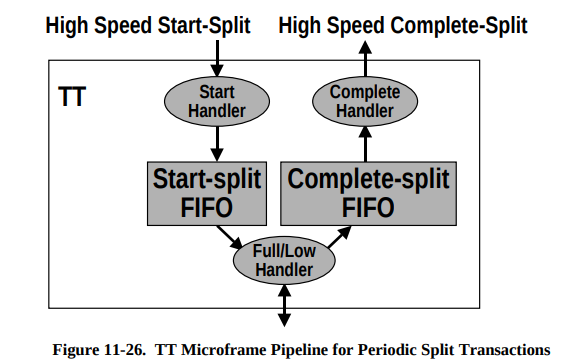
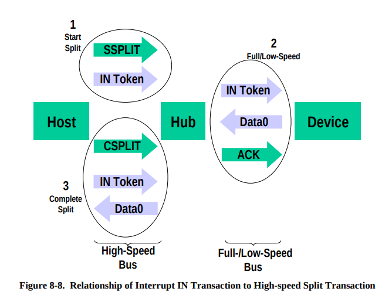
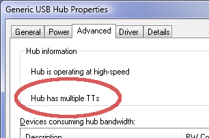

## What are Multiple TT (MTT) USB Hubs?

TT stands for Transaction Translator. The details are pretty complex, and fully documented in chapter **11.14.1** of the USB specification. In a nutshell, TT is described as following by the USB2.0 Specification:

> The TT includes a high-speed handler to deal with high-speed transactions. The TT also includes a full-/low-speed handler that performs the role of a host controller on the downstream facing ports that are operating at full-/low-speed

Section "**11.23.1 Standard Descriptors for Hub Class**" of the USB2.0 Specification defines 2 TT mode options that can be implemented in the hub: Single TT and Multiple TT. Unfortunately, this important technical detail is rarely mentioned. Most hubs use a cheaper Single-TT (STT) design. The good Multiple TT (MTT) ones are rarely advertised as having this feature, not even marked on the package.

## What is the Difference Between STT and MTT Hubs?

The best way to show the difference between STT and MTT hubs is look at the case when a high-speed and a low-speed devices are connected to the same hub. 
Let's assume we have a STT hub with AM01 and a mouse plugged into it. To simplify things, we will use following TT mechanism (Sections ***11.14.2.1***, ***11.14.2.2*** of the USB2.0 Specification):

Which means that your PC actually communicates with the Transaction Translator in the hub. It sends 2 messages. First, SSPLIT (Start Split Transaction) message is sent to the TT. **If the TT is not busy**, it sends an acknowledgement. Then the TT transmits IN token to your low-speed device (mouse) at the slower 12 MBit/sec speed. Meanwhile, your PC is able to communicate with other devices at 480 Mbit/s. While low-speed data receiving is processed by the TT, your PC begins sending CSPLIT (Complete Split Transaction) messages to the hub's TT. The TT replies with a special NYET response if the TT is still busy communicating at 12 Mbit/sec, or the NAK or DATA from your device.


If you have both a keyboard and a mouse connected, what happens if your PC wishes to send a SSPLIT message to ask the TT to communicate with the mouse, but the TT is already busy communicating with the keyboard? With only a single TT, the hub will reply NYET to a new SSPLIT request, because it is busy performing another operation.

Multiple TT hubs have a dedicated TT on every downstream port. With multiple TTs, the hub is always able to accept a SSPLIT request, even when the other TTs are busy communicating other downstream devices. With only a single TT, you may experience bottlenecks and waiting, even through there's plenty of 480 MBit/s bandwidth, because the hub has limited ability to convert more than 1 message at a time between the different speeds.

More detailed information about TT internal logic can be found in section ***11.17.1 Bulk/Control Split Transaction Sequences*** of the USB2.0 Specification.

## How to find out if your hub is STT or MTT

On Linux, the hub type can be checked with `lsusb` command. TT information is provided in `bDeviceProtocol` field of the device descriptor of the hub in the question. Alternatively, one can run
`lsusb -v | grep TT` or `lsusb -v | grep bDeviceProtocol` for the list of the `bDeviceProtocol` fields for all connected devices.
```bash {3,5,6,8}
lsusb -v | grep TT
  bDeviceProtocol         1 Single TT
  bDeviceProtocol         2 TT per port
      bInterfaceProtocol      1 Single TT
      bInterfaceProtocol      2 TT per port
  bDeviceProtocol         2 TT per port
      bInterfaceProtocol      1 Single TT
      bInterfaceProtocol      2 TT per port
  bDeviceProtocol         1 Single TT
```
* Highlighted lines indicate MTT Hubs with 1 TT per hub port.

On MacOS, it is possible to install `lsusb` command line tool which was back-ported to MacOS long time ago via `macports` or `homebrew` install systems: `sudo port install usbutils`. Once installed, the steps are exactly the same as for Linux.

On Windows, you can check if your hub has this feature using the Windows Device Manager. Look for the words "Hub has multiple TTs" in the Advanced tab:


## Conclusion

We recommend using MTT USB Hubs with any USB peripheral that requires frequent data transfers or when you're mixing high-speed and full/low-speed peripherals on your hub. While MTT hubs are slightly more expensive compared to STT, they provide more reliable communication paths for the systems that require frequent data transfers.
USB2.0 hubs can use two distinctly different designs and you really want to avoid the cheaper Single TT hubs. So you _really_ want to make sure your USB hubs are MTT types, if you plan to maximize performance and use your AtomMiner equipment successfully.