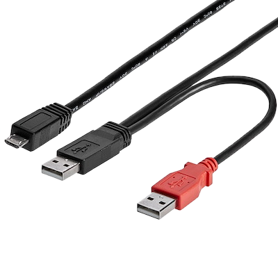

## Risks of Using Y-Cables for Power Delivery

While some older devices like external hard drives and similar were using USB Y-cables to supply enough current to the device, these cables are explicitly prohibited by [USB tech specification](https://compliance.usb.org/index.asp?UpdateFile=Policies#72). 

:::warning
**NEVER USE** use any USB Y-Cables with any USB devices.
:::

Below is the typical USB Y-cables that one can buy from most computer shops and online platforms:

USB Power Policy clearly states that:
>   Use of a Y-cable (a cable with two A-plugs) is prohibited on any USB peripheral. If a USB peripheral requires more power than allowed by the USB specification to which it is designed, then it must be self-powered.

Yes, Y-cables are forbidden by the USB specification for a reason. Connecting the A-plugs of a Y-cable into two different host ports (i.e. two different USB controllers or two different computers, a computer and a hub, etc.) can lead to multiple electrical problems:

*  One of the USB ports may be unpowered while the other one is powered on. This will result in the powered USB port pushing current to the unpowered one in the wrong direction, possibly resulting in damage.
* Even if both USB ports are powered, but one will provide a slightly higher or lower voltage than the other, resulting in a problem similar to problem.
* If you're extremely unlucky and connected your Y-cable to a poorly isolated Power Supply, you're using common ground cable (which is your USB Y-cable). There's a good chance that your cable will zap both power sources along with your USB device.

:::warning
**NEVER USE** use any USB Y-Cables with any USB devices.
:::

